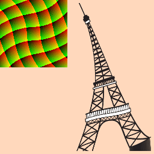
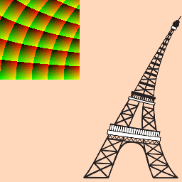
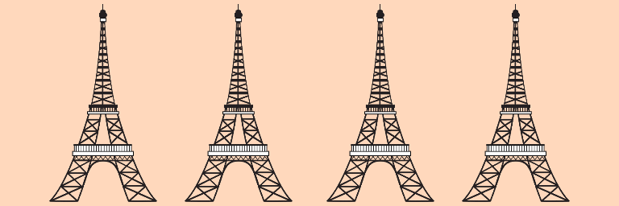
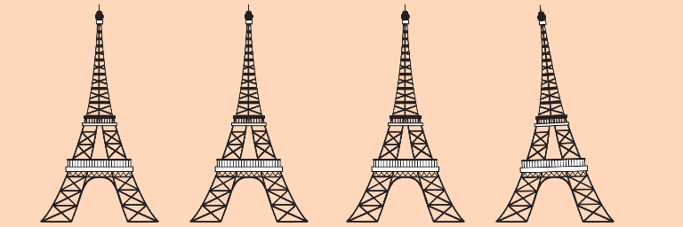
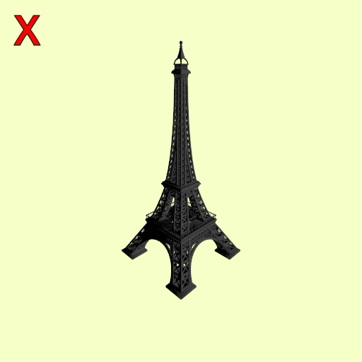

+++
title = "Elastic Deformations and Damped Oscillations"
date = "2020-11-14T13:25:44Z"
author = "Lucas Van Mol"
authorTwitter = "" #do not include @
cover = ""
tags = ["godot", "shaders"]
keywords = ["", ""]
description = ""
readingTime = false
hideComments = false
math = true
color = "" #color from the theme settings
+++


> This post uses Godot, but it should be straightforward enough to transcribe it to other engines. It also assumes some basic knowledge of shaders and linear algebra.


In a small game called [Hook Head](https://6e23.itch.io/hook-head) I made for a game jam, the main character has a spring-like appendage which reacts organically to the character's movement. This post will talk about this effect and also how to create the same effect in 3D. A demo of the contents of this post is available [on GitHub](https://github.com/lucasvanmol/godot-oscillator-shader).


---

## Bending in 2D

In linear algebra, 2D space can be rotated using a rotation matrix like this one:

$$
R(\theta) =
\begin{bmatrix}
   \cos \theta & -\sin \theta \\\\
   \sin \theta & \cos \theta
\end{bmatrix},
$$

where θ is the angle of rotation. Such a matrix can be used in a shader by multiplying it by the UV's in order to rotate the texture by an angle θ. For a bending effect, we can let the angle of rotation at each pixel be proportional to the euclidean distance between the pixel and some center point. This means that the further away a pixel is from the center point, the more the pixel gets rotated and curved away from its original position - also known as a twirl. We can multiply the distance by some strength value to control how much twirl we want.




However, there are two problems. The first are the graphical glitches which occur at the edges of the sprite, and the other problem is that the bottom of the sprite does not remain level.

The graphical glitches can be fixed by adding some invisible padding around the sprite. For the bottom of the sprite to remain level, the twirl shader needs to be modified so that the angle of rotation is proportional to only the difference in y-coordinates between the pixel and the center point instead of the euclidean length. This will cause the horizontal line that crosses through the center point to remain level:



This gets us the effect that we want. Note that if we wanted to bend our sprite past its own boundaries, the sprite would get cut off. This can again be fixed by adding more padding. Here is the final shader code, where we use the rotation matrix mentioned above and have the angle be proportional to the height difference of the pixel and the center point.

```gray
shader_type canvas_item;

uniform float STRENGTH = 0.0;
uniform vec2 CENTER = vec2(0.5);

void fragment() {
	vec2 uv = UV - CENTER;
	float angle = STRENGTH * uv.y;
	mat2 rot = mat2(
		vec2( cos(angle), -sin(angle) ),
		vec2( sin(angle),  cos(angle) )
	);
	uv = rot * uv + CENTER;
	COLOR = texture(TEXTURE, uv);
}
```

## Making it spring

Now that we have a way to convincingly bend the sprite in 2D, we need some movement code in order to create organic looking motion. In physics, systems like the one we are trying to create are known as damped oscillators. They're very useful for describing things that vibrate, such as pendulums, springs or guitar strings. Their motion can be described by a simple equation:

```gray
force = -spring_const * displacement + damping_const * velocity
```

The displacement value in this equation corresponds to the strength value that we used in the bend shader. In order to calculate what the displacement should be at each frame, we need to know what the value of the force is that's acting on the oscillator at that frame. To do this, we need to keep track of the displacement and the velocity of the oscillator and update them accordingly each frame. In Godot, this would look something like this:

```gray
extends Sprite

var displacement := 0.0
var velocity := 0.0

export (float) var spring_constant := 150.0
export (float) var damp_constant := 5.0

func _process(delta):
	var force = -spring_constant * displacement + damp_constant * velocity
	velocity -= force * delta
	displacement -= velocity * delta
	material.set_shader_param("STRENGTH", displacement)
	
	if Input.is_action_just_pressed("ui_accept"):
		velocity = 20
```

Now when we press the required action, the velocity of the oscillator makes it go flying toward the right before oscillating back to its equilibrium position.


---

## The Damping Ratio (aside)

Playing around with the values of spring and damping constants will result in different effects. The spring constant controls the force that pulls the oscillator back towards the equilibrium position - essentially how 'springy' it is.


*Varying the spring constant from high to low - notice how they all come to a stop at the same time*

The dampening constant acts like friction, gradually slowing down the amplitude of the oscillations. An interesting ratio to note here is the damping ratio ζ , which is calculated in the following way:

```
damping_ratio = damping_const / (2 * sqrt(spring_constant))
```


> Note that in this equation and in the oscillator script, we have rather crudely, but conveniently, considered the mass to be equal to 1


The damping ratio ζ determines the behavior of the oscillator:

* ζ > 1: the system is overdamped, and the oscillator decays to a steady state without oscillating. The larger the damping ratio, the slower the system will return to equilibrium.

* ζ = 1: the system is critically damped, and returns to equilibrium as quickly as possible without oscillations.

* ζ < 1: the system is underdamped, and oscillates with gradually decreasing amplitude until it returns to equilibrium.
  
* ζ = 0: the system is undamped, and oscillates at a constant amplitude.


*Varying the damping constant: overdamped, critically damped, underdamped and undamped*

Once you have settled on how you want the oscillations to look like, you can integrate them into your game. In [Hook Head](https://6e23.itch.io/hook-head), the velocity value of the oscillator is tied to the velocity of the character, meaning it will bend when the character is in movement, and spring back to equilibrium when the character stops. There's also some velocity added when you attack, in order to provide another dimension of feedback for a player's actions.


---

## Making it work in 3D
There is not much more work to be done to get this effect working in 3D. We just need a way to rotate 3D space, which can be done by using three 3x3 matrices:

$$
R_x(\theta) =
\begin{bmatrix}
	1 & 0 & 0 \\\\
   	0 & \cos \theta & -\sin \theta \\\\
   	0 & \sin \theta & \cos \theta
\end{bmatrix}
$$

$$
R_y(\theta)_y =
\begin{bmatrix}
	\cos \theta & 0 & \sin \theta \\\\
   	0 & 1 & 0 \\\\
   	-\sin \theta & 0 & \cos \theta
\end{bmatrix}
$$

$$
R_z(\theta) =
\begin{bmatrix}
   	\cos \theta & -\sin \theta & 0\\\\
   	\sin \theta & \cos \theta & 0 \\\\
	0 & 0 & 1
\end{bmatrix}
$$

Each of these matrices will rotate space across the x-, y- and z-axes, and the rotations can be combined by multiplication in order to rotate in any direction. For a 3D version of the bend shader, we use these three matrices, along with three separate corresponding strength values, to bend the mesh. Also, we can put it in a vertex shader as opposed to the fragment shader used in 2D.

```gray
shader_type spatial;

uniform float strength_x = 0.0;
uniform float strength_y = 0.0;
uniform float strength_z = 0.0;

uniform vec3 center = vec3(0.0, 0.0, 1.0);

void vertex() {
	vec3 v = VERTEX - center;
  
	float delta = v.y * 0.1;

	float theta = strength_x * delta;

	mat3 rot_x = mat3(
		vec3(1, 0, 0),
		vec3(0, cos(theta), -sin(theta)),
		vec3(0, sin(theta), cos(theta))		
	);

	float phi = strength_y * delta;

	mat3 rot_y = mat3(
		vec3(cos(phi), 0, sin(phi)),
		vec3(0, 1, 0),
		vec3(-sin(phi), 0, cos(phi))		
	);

	float psi = strength_z * delta;

	mat3 rot_z = mat3(
		vec3(cos(psi), -sin(psi), 0),
		vec3(sin(psi), cos(psi), 0),
		vec3(0, 0, 1)		
	);

	VERTEX = v * rot_y * rot_x * rot_z + center;
	NORMAL = NORMAL * rot_y * rot_x * rot_z;
}
```
The normals are easily recalculated by appling the same rotation without the offset

Here we can see how each matrix affects the mesh:



In order to get a satisfying springy effect, we'll use the X and Z rotations to deform the mesh. We can rewrite the oscillator script to use a Vector2 for the velocity and the displacement, as we're rotating in two dimensions, and update the shader accordingly.

To make it interactive, I've added some collision detection to detect when the mesh is pressed, and the displacement value is updated by a value proportional to the vector pointing from the mouse press position to the current mouse position. When the mouse press is released, the oscillator script goes to work.


---

## Optimizations and Other Approaches

This post has been much longer than I anticipated, but I'll quickly go over some optimizations that can be made. The first is precalculating the rotation matrices, as this can be done ahead of time by the CPU, and will save costly GPU trig calls. 

But while transformations using matrices may be conceptually easier to understand, rotations can also be done with quaternions, which are more efficient if all you want to do is rotate. How quaternions work is quite out of scope of this post, but [here's an example](https://gist.github.com/lucasvanmol/ccf79ef37c125d61abc288dbd216dfe2) of how you could implement them.

For another approach to boingy buildings, check out [this great post](https://www.glasstomegames.co.uk/blog/20-08-28-springy-buildings/) by GlassTome Games, which uses Bezier curves for rotation.

---

*3D Eiffel Tower model by [cbmbeach](https://www.cgtrader.com/free-3d-models/architectural/engineering/eiffel-tower-056df590-f97e-4f93-8e11-3f2bd25951da)  -  licensed under CC BY-SA 3.0*