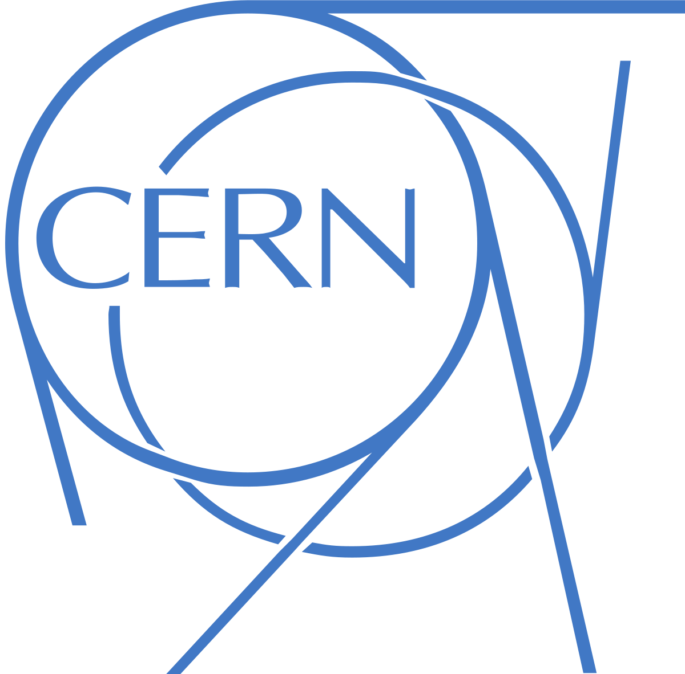

## Experience

<table>
    <thead>
        <tr>
            <th style="width: 50px">Company</th>
            <th></th>
            <th>Job Title</th>
            <th>Dates</th>
            <th>Location</th>
        </tr>
    </thead>
    <tbody>
        <tr>
            <td></td>
            <td><b>Web3 Foundation</b></td>
            <td>Technical Grants Evaluator</td>
            <td>Jun - Aug 2022</td>
            <td>Zug, CH</td>
        </tr>
        <tr>
            <td></td>
            <td><b>Cern</b></td>
            <td>Summer Student Intern</td>
            <td>Jun - Aug 2021</td>
            <td>Geneva, CH</td>
        </tr>
        <tr>
            <td></td>
            <td><b>Cern Micro Club</b></td>
            <td>Software Engineering Intern</td>
            <td>Jan - May 2021</td>
            <td>Geneva, CH</td>
        </tr>
</table>

## Education

<table>
    <thead>
        <tr>
            <th style="width: 50px">University</th>
            <th></th>
            <th>Degree</th>
            <th>Dates</th>
            <th>Location</th>
        </tr>
    </thead>
    <tbody>
        <tr>
            <td></td>
            <td><b>TU Delft</b></td>
            <td>MSc Computer Science</td>
            <td>2023 - 2025</td>
            <td>Delft, NL</td>
        </tr>
        <tr>
            <td></td>
            <td><b>Universty of British Columbia</b></td>
            <td>Exchange Year</td>
            <td>2021 - 2022</td>
            <td>Vancouver, CA</td>
        </tr>
        <tr>
            <td></td>
            <td><b>University of Birmingham</b></td>
            <td>BSc Natural Sciences (Computer Science and Physics) <i>1st Class Honours, 4.25 GPA</i></td>
            <td>2018 - 2023</td>
            <td>Birmingham, UK</td>
        </tr>
</table>
